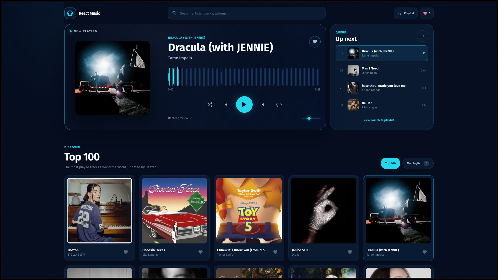

<div align="center">
  <h1>React Music</h1>
  <p>A web application for searching for music, listening to previews, and creating a favorites playlist.</p>
</div>



## About

React Music is a music player that uses the Deezer catalog. It allows users to browse popular tracks, search for tracks, artists, and albums, and listen to available previews.

## Features

- List of the most popular tracks worldwide.
- Search by track, artist, or album.
- Music previews provided by Deezer.
- Playback, volume, repeat, and shuffle controls.
- Queue showing the upcoming tracks.
- Favorites playlist.
- Responsive layout for desktop, tablet, and mobile devices.

## Technologies

- React
- TypeScript
- Styled Components
- Deezer API
- Zustand

## Run locally

You need a Deezer API key from RapidAPI.

```bash
npm install
cp .env.example .env
```

Add your key to `.env`:

```env
VITE_RAPIDAPI_KEY=your_key
```

Then start the application:

```bash
npm run dev
```
